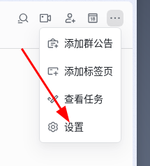
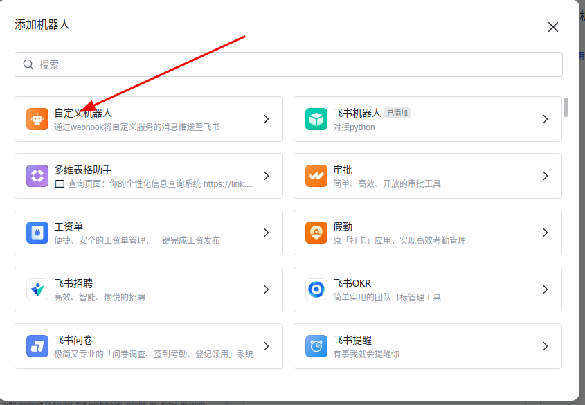
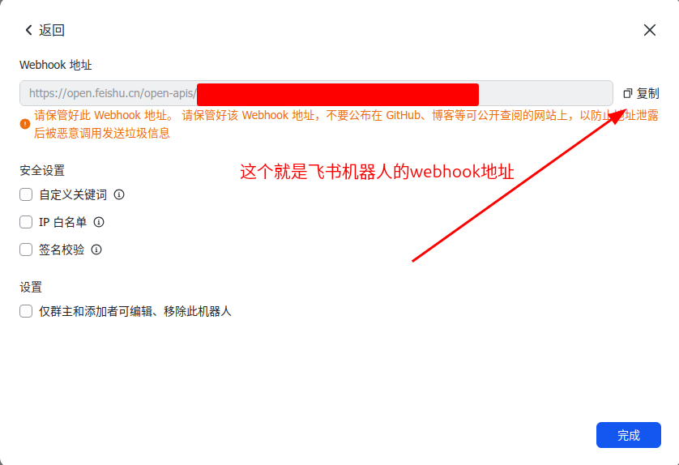
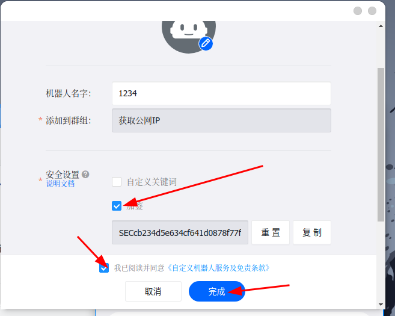
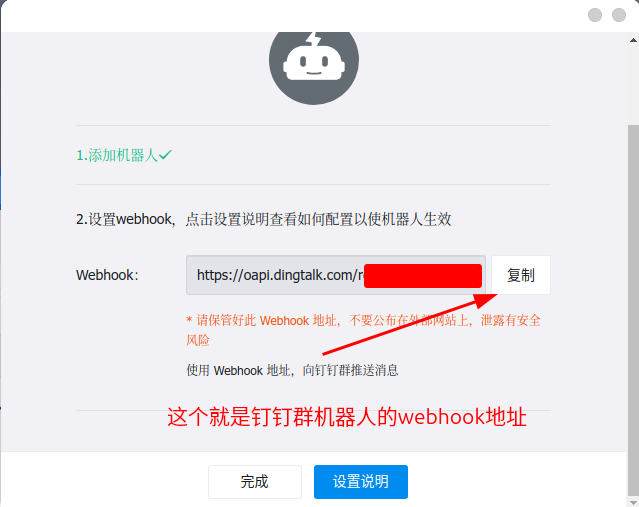

# 服务器公网IP变动通知服务

## 项目概述
本项目旨在开发一个轻量级的后台服务，用于自动监测本机公网IP变化，并通过多种渠道（邮件、飞书、钉钉）实时通知相关人员。同时，对外提供一个简单的API接口，以便其他内部系统可以按需查询该服务器的当前公网IP。

## 功能特性
- 自动监测本机公网IP变化，支持多IP地址（如双栈IPv4/IPv6）。
- 支持通过飞书、钉钉、企业微信等渠道实时通知相关人员。
- 提供简单的API接口，用于查询当前公网IP地址。
- 高度可配置化，支持自定义IP检查间隔、通知渠道、API服务端口等。
- 基于Docker容器化部署，方便在不同环境中部署和管理。

##  添加群机器人步骤
- 飞书







- 钉钉





## 配置步骤
1. 复制 `.env_example` 为 `.env`。
2. 根据实际情况修改 `.env` 中的配置项，包括IP检查间隔、API服务端口、API访问Token、各通知渠道的配置信息等。
```
[feishu]
webhook =                      #飞书群机器人webhook链接
user_id =                      #用户ID，用于@某个用户
all_user = False               #是否@全体成员

[dingtalk]
webhook =                      #钉钉群机器人webhook链接
secret =                       #钉钉群机器人密钥
at_all = True                  #是否通知全体成员  

[webhook]
webhook1 =                     #第一个webhook链接
secret_key =                   #加密通信密钥

[email]
smtp_host = smtp.qq.com        #smtp推送服务器
smtp_port = 465                #smtp推送端口
sender_email =                 #发送邮件的邮箱
sender_pass =                  #发送邮件的邮箱密码
receiver_email =               #接收邮件的邮箱

[time]
sleeptime = 10                 #循环运行脚本的间隔时间
timeout = 10                   #访问获取IP的API的超时时间 

[APIS_URL]                     #一些免费获取公网IP的API
ipify = https://api.ipify.org?format=json, ipify, lambda x: x["ip"]
ipinfo = https://ipinfo.io/json, ipinfo, lambda x: x["ip"]
my-ip.io = https://api.my-ip.io/ip.json, my-ip.io, lambda x: x["ip_address"]
ip.sb = https://api.ip.sb/jsonip, ip.sb, lambda x: x["ip"]
icanhazip = https://icanhazip.com, icanhazip, lambda x: x.strip()

[file_name]
ip_file = ip.txt               #将IP地址储存在此文件内
log_file = app.log             #将log储存在此文件内
```
   

## 部署步骤
1. 确保已经安装了Docker和Docker Compose。
2. 在项目根目录下执行以下命令构建并启动容器：
   ```bash
   docker-compose up -d
   ```